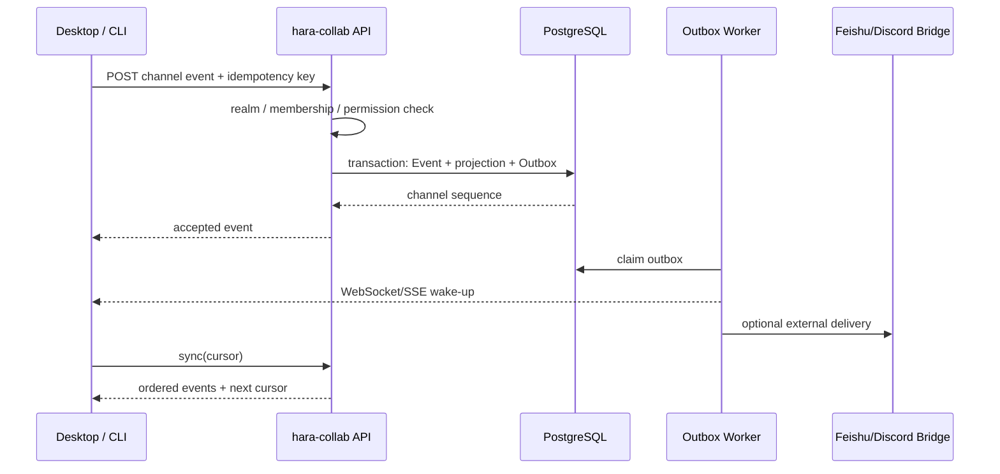

# Hara 协作平台架构：公共社区、公司群组与原生 Agent 协作

> 状态：Accepted（M0 实施中）
>
> 日期：2026-07-26
>
> 目标：让 Hara 逐步具备 Discord 式“大群组 + 频道”体验，并在不混淆公司安全边界的前提下，
> 承接目前由飞书群完成的聊天、任务、文件、Agent 协作和通知。

本提案的服务、协议、许可和可选启用边界已经由
[`docs/adr`](./adr/README.md) 中的 ADR 接受。后续实现若要改变这些边界，必须增加替代 ADR，
不能只修改本文。

## 1. 结论

应该做“大群组”概念，但不能把它直接等同于公司、部门或 Matrix Space。

Hara 需要三个彼此独立的领域概念：

| 概念 | 用途 | 示例 |
| --- | --- | --- |
| `Tenant` | 公司级安全、数据、计费和合规边界 | 南荒科技、客户 A |
| `OrgUnit` | 公司内部治理树 | 集团 → 公司 → 部门 → 组 |
| `Community` | Discord Guild 式协作容器，内部包含频道、角色和成员 | Hara 公共社区、研发协作群、客户项目群 |

Discord 官方把 Guild 定义为相互隔离的用户和频道集合，产品界面中称为 Server。
这个“协作容器”概念值得借鉴，但 Hara 的公司边界不能只靠 Guild 成员关系表达。
参考：[Discord Guild Resource](https://docs.discord.com/developers/resources/guild)。

第一阶段应优先交付公司内部群组。公共社区从数据模型开始支持，但等租户隔离、举报审核、
滥用治理和内容生命周期成熟后再开放。

## 2. 为什么不能继续复用 `Organization`

现有 `hara-control` 的 `Organization` 是一个治理树节点，定义见
[`prisma/schema.prisma`](../prisma/schema.prisma) 和
[`docs/org-hierarchy.md`](./org-hierarchy.md)。一个部门或小组可以继承公司策略，但它不是：

- 用户账户的安全租户；
- 可被自由加入或退出的协作社区；
- 带频道、角色、消息和文件的聊天容器；
- 公共社区。

如果继续复用一个 `orgId` 同时表达上述含义，会产生四类问题：

1. 用户加入一个群等同于进入公司安全边界；
2. 切换公司时难以判断现有会话、任务和 Agent 应归属哪里；
3. 公共群和内部群无法使用同一套结构又保持数据隔离；
4. 部门树调整会意外改变聊天历史和权限。

因此，`hara-control` 仍保持“一次自托管部署服务一个公司/集团”的产品边界；多公司账户、
公共社区和原生聊天属于独立的 Hara Account/Collaboration 平面。托管版可在同一服务中承载
多个 `Tenant`，自托管版默认只暴露一个 `Tenant`。

## 3. 产品信息架构

桌面端建议采用两级切换：

```text
身份/安全域
├─ 🌐 Hara 公共
│  ├─ Hara 用户社区
│  │  ├─ # 公告
│  │  ├─ # 问答
│  │  └─ # 插件与技能
│  └─ 设计 Agent 社区
├─ 🏢 南荒科技
│  ├─ Hara 研发
│  │  ├─ # 日常讨论
│  │  ├─ # BUG 反馈
│  │  ├─ # Agent 运行
│  │  └─ # 发布
│  └─ 产品与设计
└─ 🏢 客户 A
   └─ 项目交付
      ├─ # 需求
      ├─ # 任务
      └─ # 文件
```

上层切换器选择的是 `SecurityRealm`，不是简单 UI 过滤器。下层 `Community` 是“大群组”，
`Channel` 是其内部频道。

### 3.1 切换公司的行为

切换公司只改变：

- 新建会话、频道、任务和 Agent 运行的默认身份；
- 左栏默认显示的社区和频道；
- 默认可用的企业模型连接与策略。

切换公司不得改变：

- 已打开会话绑定的安全域；
- 正在运行的任务和 Agent；
- 已选中的企业模型路由；
- 文件上传的归属；
- 历史消息的查询范围。

如果用户在“南荒科技”的会话中把全局切换器改成“客户 A”，当前会话仍显示
“南荒科技 · Hara 研发 · #BUG 反馈”。用户要在客户 A 发言，应显式打开或新建客户 A 的频道。

### 3.2 四个独立状态

客户端不能再用一个 `activeOrganizationId` 驱动所有功能。至少需要独立保存：

```ts
type ActiveContext = {
  accountId: string;
  defaultRealmId: string;
  openCommunityId?: string;
  openChannelId?: string;
  modelConnectionId?: string;
};
```

每一个已打开的会话还要固定保存：

```ts
type PinnedConversationContext = {
  realmId: string;
  principalId: string;
  tenantMembershipId?: string;
  communityId: string;
  channelId: string;
  modelConnectionId?: string;
};
```

## 4. 身份与安全域

### 4.1 账户、成员身份和主体

一个自然人只有一个全局 `Account`，但在不同安全域中拥有不同 `Principal`：

```text
Account（登录账户）
├─ Public Principal（公共昵称、头像、公开声誉）
├─ Tenant A Membership → Tenant A Principal（公司名片、部门、内部角色）
└─ Tenant B Membership → Tenant B Principal
```

Agent 和系统集成同样是 `Principal`，不冒充人：

```text
Principal.kind = HUMAN | AGENT | SERVICE
```

这使消息、任务指派、@ 提及、审计和权限都能复用同一套主体模型，同时明确区分人和 Agent。

### 4.2 Security Realm

建议先支持：

```text
PLATFORM_PUBLIC  Hara 公共安全域
TENANT           单个公司的内部安全域
```

未来确有跨公司项目需求时，再增加：

```text
EXTERNAL_COLLAB  由多个 Tenant 明确加入的外部协作域
```

不要让一个普通 `TENANT` 频道直接包含其他公司成员，否则文件、搜索、模型调用、审计和数据保留
都很难给出一致边界。

### 4.3 访问令牌

协作服务令牌至少固定以下上下文：

```json
{
  "account_id": "acc_...",
  "principal_id": "pri_...",
  "realm_id": "realm_...",
  "tenant_membership_id": "tm_...",
  "device_id": "dev_...",
  "membership_version": 12,
  "policy_version": 7,
  "aud": "hara-collab",
  "exp": 0
}
```

`membership_version` 和 `policy_version` 用于在人员离职、角色变化或策略更新后使旧授权快速失效。
用户切换公司时换取新的 realm-scoped token，而不是仅修改请求体中的 `tenantId`。

## 5. 核心领域模型

下面是目标模型，不表示直接把全部表加进当前 `hara-control`：

| 模型 | 关键字段 | 说明 |
| --- | --- | --- |
| `Account` | `id`, login identities | 全局登录账户 |
| `Tenant` | `id`, `name`, policy | 公司级隔离边界 |
| `TenantMembership` | `tenantId`, `accountId`, status, version | 一个人在一家公司的成员身份 |
| `OrgUnit` | `tenantId`, `parentId`, type | 部门治理树 |
| `Principal` | `realmId`, kind, display profile | 人、Agent、服务在安全域中的身份 |
| `Community` | `realmId`, visibility, owner | Discord 式“大群组” |
| `CommunityMembership` | `communityId`, `principalId`, state | 邀请、加入、离开、封禁 |
| `CommunityRole` | `communityId`, name, permissions | 社区角色 |
| `Channel` | `communityId`, kind, parentId | 频道、分类、讨论串 |
| `ChannelAcl` | role/member, allow/deny | 局部覆盖 |
| `Event` | `realmId`, `channelId`, seq, type, payload | 追加式事实记录 |
| `Message` | `eventId`, content, reply/thread | 消息投影 |
| `Task` | `eventId`, assignee, state | 任务投影 |
| `FileObject` | `realmId`, storage key, metadata | 文件元数据，不存公开 URL |
| `AgentRun` | `realmId`, channelId, principalId, state | Agent 执行与可见进度 |
| `Outbox` | `eventId`, destination, state | 异步分发和桥接 |
| `ReadCursor` | `principalId`, channelId, seq | 已读位置 |

### 5.1 强制关系约束

所有协作表都必须有 `realmId`。外键应优先使用复合约束，例如：

```text
(community_id, realm_id) → Community(id, realm_id)
(channel_id, realm_id)   → Channel(id, realm_id)
(principal_id, realm_id) → Principal(id, realm_id)
```

仅在应用代码中检查 `tenantId` 不够。生产数据库还要：

- 使用非 owner 的应用数据库角色；
- 对租户表启用并 `FORCE ROW LEVEL SECURITY`；
- 同时定义 `USING` 和 `WITH CHECK`；
- 后台任务、搜索索引和导出任务使用同样的 realm 约束；
- 禁止把对象存储永久 URL直接写入消息。

## 6. 权限模型

可以借鉴 Discord 的“社区角色 + 频道覆盖”。Discord 官方权限文档描述了 Guild 级角色基础权限
和频道级角色/成员覆盖；其实现使用位标志和特定覆盖顺序。
参考：[Discord Permissions](https://docs.discord.com/developers/topics/permissions)。

Hara 不应直接复制 Discord 的大整数位图和 `ADMINISTRATOR` 跨覆盖旁路。建议使用可审计的权限名：

```text
community.view
community.manage
channel.view
channel.post
channel.manage
message.edit_own
message.moderate
file.upload
task.create
task.assign
agent.invoke
agent.approve_write
agent.view_trace
```

鉴权顺序固定为：

1. 请求 token 的 `realmId` 与资源一致；
2. `TenantMembership` 或公共身份有效；
3. `CommunityMembership` 有效；
4. 合并社区角色基础权限；
5. 应用频道角色覆盖；
6. 应用成员覆盖；
7. 显式 deny 胜出；
8. 检查公司策略、模型策略和高风险动作审批。

管理员可以在自己的 realm 内拥有全部社区权限，但任何角色都不能越过 realm 边界。

## 7. 事件、消息和同步

Matrix 把房间内的数据表达为事件，并让客户端通过同步接口获取增量。这个思路适合 Hara：
消息、任务状态、Agent 进度、文件和成员变化都可以共享一个追加式事件骨架。
Matrix 的开放协议背景和 Room/Event 模型见
[Matrix Specification](https://spec.matrix.org/latest/)。

Hara 的首期实现应保持中心化和易运维：



关键规则：

- `Event` 只追加，业务对象由投影表承接；
- 每个发送请求带客户端生成的幂等键；
- 频道内使用单调序号，客户端按 `(channelId, seq)` 去重；
- WebSocket/SSE 只负责提醒“有新数据”，断线恢复始终调用 `sync(cursor)`；
- 同步响应要明确 `nextCursor`、`limited/gap` 和回填入口；
- 消息编辑/撤回生成新事件，不覆盖审计事实；
- Outbox 与事件在同一数据库事务中落盘。

Hara 不应在首期复制 Matrix 的：

- 跨 homeserver 联邦；
- 房间事件 DAG 和 state resolution；
- 全局别名体系；
- 房间版本兼容矩阵；
- 端到端加密设备密钥网络。

这些复杂性服务于去中心化联邦，不是公司内部聊天 MVP 的必要条件。

## 8. 文件、搜索、通知和 Agent

### 8.1 文件

- 文件对象必须绑定 `realmId` 和上传者 `principalId`；
- 下载通过短期签名 URL 或授权流式接口；
- 病毒扫描、类型嗅探、大小限制和内容安全状态进入文件生命周期；
- 消息只引用 `fileId`；
- 转发到飞书等外部渠道前重新做目标渠道权限检查。

### 8.2 搜索

第一阶段可用 PostgreSQL 全文检索，后续再引入独立索引。任何搜索都必须先生成调用者可读的
`realmId + community/channel` 范围，再执行关键词或向量排序；不能“先全库召回，再在客户端过滤”。

### 8.3 通知

通知偏好按 `Account → Realm → Community → Channel` 逐级覆盖，至少支持：

- 全部消息；
- 仅 @我；
- 仅任务/审批；
- 静音；
- 工作时间。

系统通知和飞书/桌面通知使用同一个 `NotificationEvent`，由投递器决定目标，避免目前多个监听器
对同一事件重复弹系统通知。

### 8.4 Agent 和任务是一等主体

Hara 的差异化不是重做一个普通 IM，而是让 Agent 在频道中成为可治理的协作者：

- Agent 有独立 `Principal`、头像、能力范围和审计身份；
- `@Agent` 可启动绑定频道和项目的 `AgentRun`；
- 运行过程发结构化状态事件，不刷屏伪造普通文本；
- 写文件、发外部消息、发布和花费高额度模型仍走审批；
- 任务可以指派给人或 Agent；
- Agent 只能读取它有权访问的频道、文件和项目；
- 模型连接固定在运行上下文，切公司或切模型不会偷换进行中的执行。

## 9. 服务边界

推荐新建独立 NestJS 服务/仓库 `hara-collab`：

```text
hara-account
  Account / TenantMembership / 登录 / 公司切换

hara-collab
  Realm / Principal / Community / Channel
  Event / Message / Task / File / Sync / Search
  Membership / Role / ACL / Notification / Bridge

hara-control（保持当前职责）
  单公司/集团 OrgUnit
  设备、企业模型连接、额度、Agent 治理、审计

hara-cli gateway
  Feishu / WeCom / Discord / Matrix 等外部桥

hara-desktop
  realm/community/channel UI
  统一消息与 Agent 任务体验
```

`hara-collab` 通过稳定 ID 引用 hara-control 的 `OrgUnit`、`DigitalEmployee` 和模型连接，
不复制控制面的密钥、额度和设备数据。

## 10. 现有代码可复用与缺口

### 可复用

- `hara-cli/src/gateway/feishu.ts` 的持久化 spool、重试、死信和幂等思路；
- `hara-cli/src/gateway/matrix.ts` 的 Client-Server `/sync` 适配器，可作为学习样本；
- `hara-control` 的哈希链审计和令牌纪律；
- Desktop 现有 session、外部渠道会话和 Agent 运行展示。

### 必须补齐

- `AdminUser.orgId` 当前只能表达一个控制面范围，不能用作多公司账户成员关系；
- `Organization` 同时承载公司、部门和团队治理语义，不应继续承载社区；
- Desktop 目前只有本地 session 和外部来源会话，没有 realm/community/channel/member/role；
- Matrix gateway 只支持明文房间、内存 cursor 和部分消息类型，不是原生协作存储；
- Discord gateway 是外部 bot 接入，不是 Hara 自身 Guild 数据模型；
- 生产 RLS 还要完成非 owner、`FORCE`、`WITH CHECK` 和后台任务隔离；
- 需要独立文件授权、跨端 sync、搜索 ACL、通知去重和 bridge 映射表。

## 11. 飞书替换路线

不要先关掉飞书。按下面顺序逐步把 Hara 变成事实源：

### P0：安全与 ADR

- 确认 Tenant/Realm/Community 边界；
- 完成威胁模型、RLS、对象存储和审计 ADR；
- 定义事件 envelope、幂等键和 cursor；
- 明确数据保留和删除策略。

验收：任何资源都能回答“属于哪个 realm、由哪个 principal 创建、谁能读”。

### P1：公司内部 MVP

- 公司切换；
- 内部 Community、文本频道、成员和角色；
- 文本、图片、文件、回复、@、未读、搜索；
- Desktop + CLI 同步；
- 基础通知。

验收：南荒内部可以在 Hara 完成一个 BUG 从报告、讨论、任务到验证的闭环。

### P2：原生 Agent 协作

- Agent Principal；
- 频道内运行、任务、审批和结构化状态；
- 项目/模型连接固定；
- 额度和审计关联。

验收：Agent 的每次外部写操作都能追到人、公司、频道、模型和审批。

### P3：飞书双向桥

- Hara Channel ↔ Feishu Chat 显式映射；
- 消息/附件/回复 ID 映射；
- 幂等、重试、死信和可观测状态；
- 迁移期双写由 Outbox 管理。

验收：断线和重试不会重复发消息；桥失败不丢 Hara 原始事件。

### P4：公共社区

- 可发现/邀请制社区；
- 举报、封禁、限流、内容审核和防滥用；
- 公共身份与公司身份严格分离；
- 社区运营和插件/技能分发。

验收：公共社区无法读取任何公司内部数据，管理员也不能跨 realm 旁路。

### P5：规模化

- 分片、归档和搜索索引；
- 大群成员/权限缓存；
- Sliding Sync 类客户端窗口同步；
- 多区域和灾备；
- 经许可后再评估 E2EE 或 Matrix 联邦。

## 12. 首批需要做出的产品决定

进入实现前只需确认以下几个高影响选项：

1. UI 中文名称使用“群组”还是“社区”；代码统一用 `Community`。
2. 公共社区第一版是只读公告/官方问答，还是允许用户自建。
3. 外部客户协作是否首期需要；建议不需要，先保留 `EXTERNAL_COLLAB` 扩展位。
4. 飞书桥以 Hara 为主事实源还是镜像；P3 起建议 Hara 为主事实源。
5. 聊天数据生产部署与 hara-control 共库不同 schema，还是独立数据库；建议独立数据库，
   降低消息高写入量对模型控制面的影响。

## 13. 推荐决策

- 产品名：界面叫“群组”，技术模型叫 `Community`；
- 首发：公司内部群组；
- 公共：数据模型同时具备，功能在 P4 开放；
- 服务：新建 `hara-collab`，不把聊天塞进 `hara-control`；
- 存储：中心化 PostgreSQL 事件流 + 投影 + Outbox；
- 客户端：cursor sync + WebSocket/SSE wake-up；
- 权限：realm 硬隔离 + 可读权限名 + 社区角色 + 频道覆盖；
- 桥接：保留飞书，先双向桥，稳定后再逐步把群聊主入口迁到 Hara；
- Matrix：学习 Room/Event/Sync/Membership，不复制联邦复杂度。
